<div align="center">

# 🛵 LAST MILE

### *an endless night shift as a London delivery rider, seen over the handlebars*


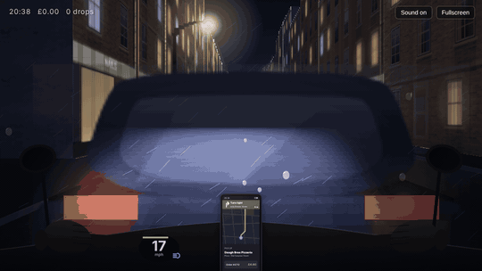

**The rain's coming in sideways off Wardour Street. The phone pings. £4.15 for 1.3 miles.**
**Go on then.**

</div>

---

## What this is

**Last Mile** is a procedurally generated, first-person, *non-interactive* simulation of one never-ending shift on an electric moped, delivering takeaways across London.

You don't play it. You **watch** it, the way you'd watch rain on a window, a fish tank or a late-night bus. There's nobody to steer. The rider takes offers and turns down bad ones, filters past stationary traffic, waits at red lights, swings round corners, parks up, walks to doors, climbs stairwells that are never the right stairwell, buzzes intercoms nobody answers, reads out four-digit codes, says *"Cheers, have a good one"* and does it all again.

The whole city is generated as the rider goes: streets, shopfronts, buses, people, weather and the time of day. Nothing is downloaded. Every brick, every face, every siren and every *ping* is drawn or synthesised live in your browser.

> *It's a screensaver with a work ethic.*

<div align="center">
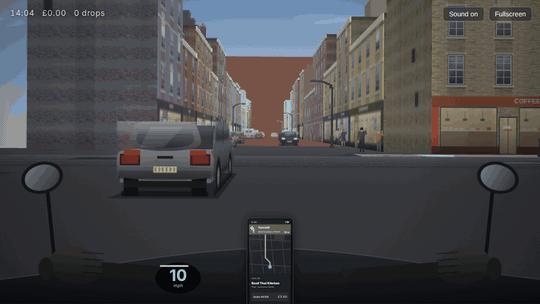
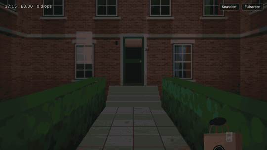
<br>
<sub><i>left: a real corner swing, with both streets drawn and the camera rotating · right: up the path, bag in hand, to a door you've never seen before</i></sub>
</div>

---

## ▶️ Start your shift

There's nothing to install. It's a static site.

```bash
git clone https://github.com/ChrisBrooksbank/last-mile.git
cd last-mile
python serve.py            # or: python -m http.server 8123
```

Open **http://localhost:8123** and press **Start the shift**. Browsers only allow sound after a click, and you want the sound.

| key | does |
|---|---|
| `M` | mute / unmute |
| `F` | fullscreen (strongly recommended, lights off, headphones on) |

---

## 📸 A shift, in stills

| | |
|:---:|:---:|
| 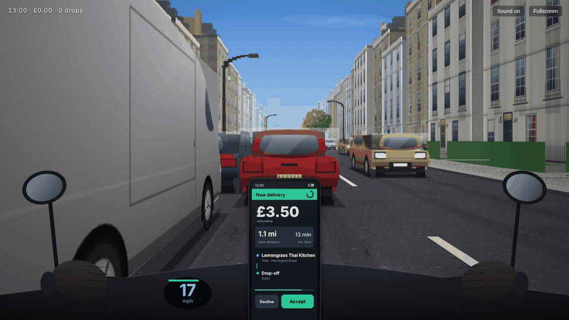 | 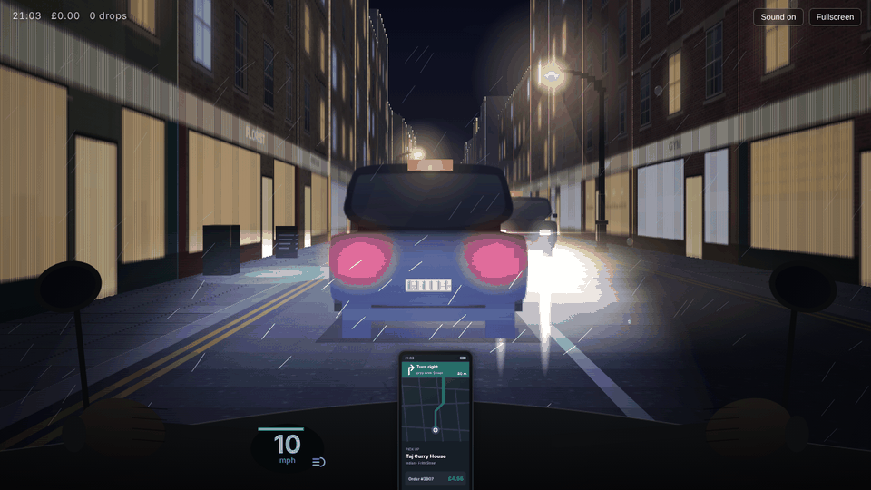 |
| **13:00, Kensington.** £3.50 for 1.1 miles. The thumb hovers. | **21:03, Soho.** Rain, a black cab, and Frith Street coming up on the right. |
| 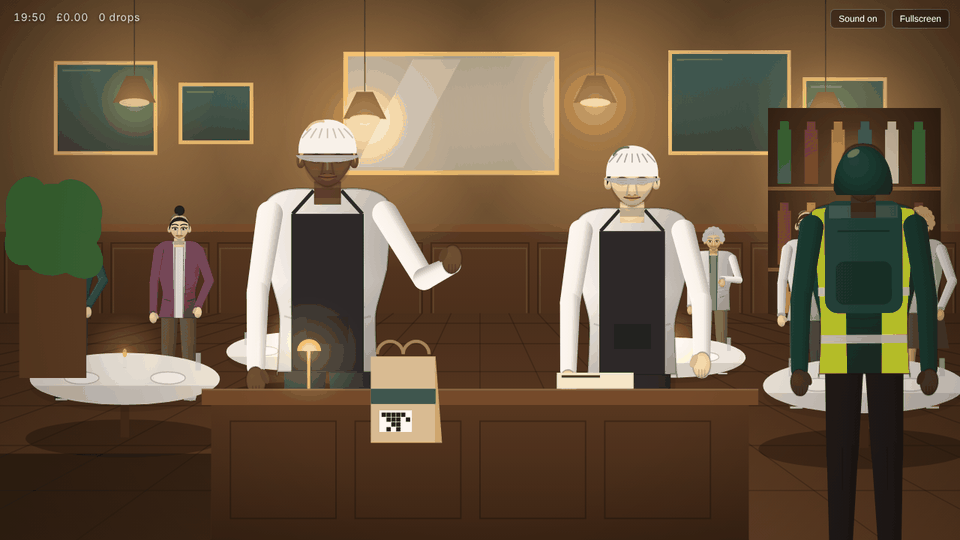 | 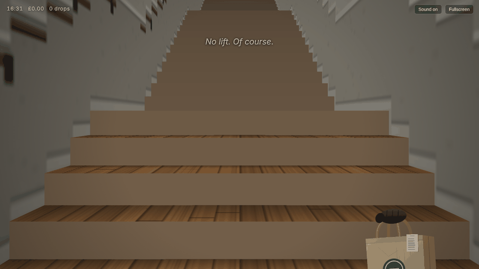 |
| **The pickup.** Scan the bag. Another rider's been waiting thirty minutes. | **The estate.** *"No lift. Of course."* |
| 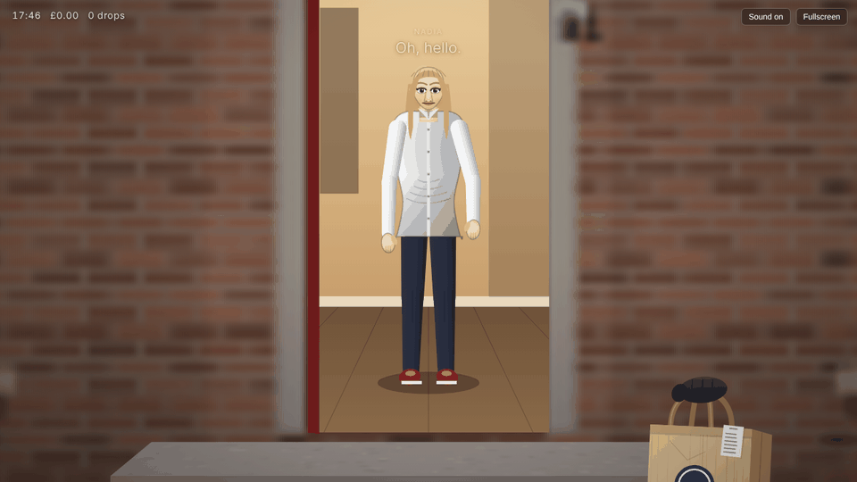 | 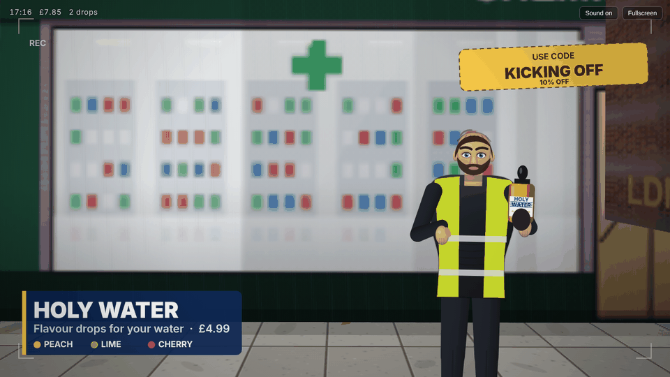 |
| **The doorstep.** *"Could I get your four-digit code, please?"* | **The side hustle.** A word from our sponsor, which is him. |
| 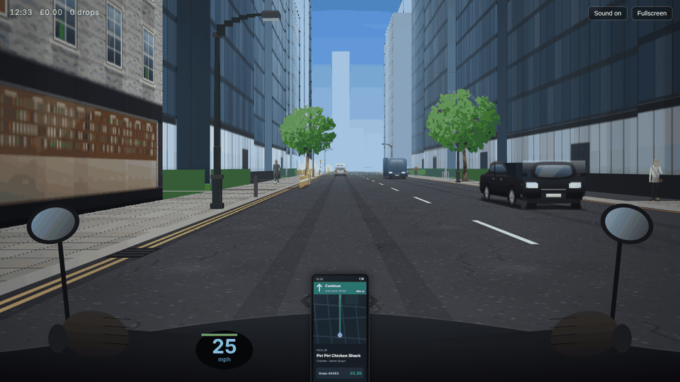 | 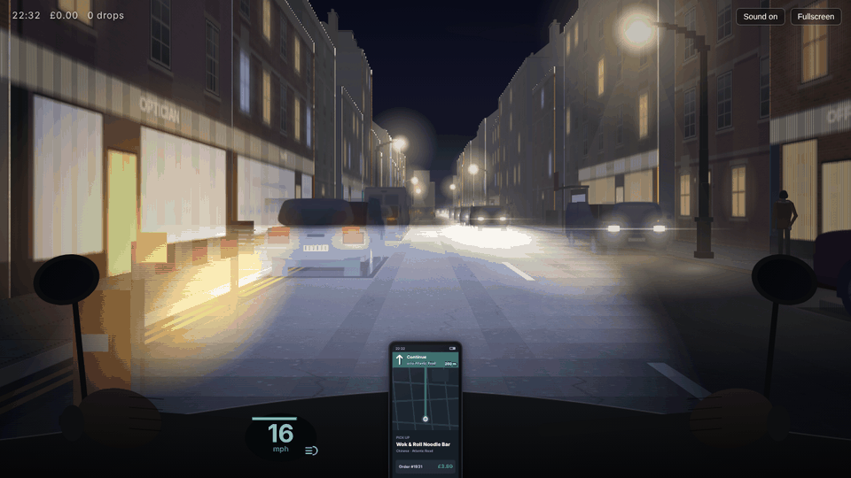 |
| **12:33, Canary Wharf.** Glass, money, a lobby and a lift. | **22:32, Brixton.** Fog rolls in. Headlight on. |

---

## 🌧️ What's in the city

**Nine districts, each with its own character.** Street names, building stock, traffic, how busy the pavements are, how many trees, how far back the houses sit and what kind of door you'll end up knocking on.

| District | Vibe | You'll probably be delivering to… |
|---|---|---|
| **Soho** | brick, neon, shopfronts all the way down | a flat above a shop on Dean Street |
| **Shoreditch** | warehouses, graffiti, Redchurch Street | a converted-loft buzzer |
| **Camden** | painted terraces, market noise | a flat, a house, or straight to the door |
| **Kensington** | white stucco, black railings, hedges | a front path and a big door |
| **Islington** | Georgian terraces, Upper Street | a house with three steps up |
| **Brixton** | Electric Avenue, Coldharbour Lane | an estate, a flat, a house |
| **Peckham** | Rye Lane, Bellenden Road | anything at all |
| **Hackney** | estates, Broadway Market | Block C. You're at Block B. |
| **Canary Wharf** | glass towers, wide boulevards | a lobby, a lift, the 14th floor |

**Things that happen, unprompted:**

- 📱 **Offers** arrive with pay, distance, restaurant and drop-off. He works out pay-per-mile, weighs up the rain and how quiet it's been, then accepts or swipes away (*"£3.20 for that? No thanks."*).
- 🚦 **Traffic** with car following, braking, red/amber/green signals, cross traffic at junctions, buses on real route numbers, black cabs, vans and cyclists. The rider **filters** to the front at red lights and **overtakes** slow traffic when the oncoming lane is clear.
- 🚑 **Sirens.** Ambulances and police cars come through with Doppler-shifted, panned two-tone sirens and blue light washing over everything. *"It's all kicking off."*
- 🧍 **People** with faces, hair, coats, umbrellas in the rain and phones in their hands. They stop to chat ("Long time no see!"), cross at zebras, and walk across side roads. The rider waits for them.
- 🍜 **Restaurants:** fast-food counters, dark ghost kitchens and proper sit-down places, with staff who are ready, nearly ready, *really* not ready, or have already handed your order to someone else.
- 🚪 **Doorsteps:** garden paths, hedges, front steps, intercoms, lifts, stairwells, corridors of numbered doors, wrong blocks, customers who don't answer, dogs that do.
- 🌦️ **Weather and time:** a real day/night cycle with sunsets, street lamps flickering on and lit windows, plus clear, cloudy, overcast, drizzle, rain and fog drifting from one to the next. Raindrops bead on the visor and the road turns into a mirror.
- 🎙️ **Voices:** dialogue is spoken through your browser's speech synthesis, picking British voices where it can, and falls back to a synthesised mumble where it can't.
- 🔊 **Sound:** motor whine rising with speed, tyre roar, rain, wind, distant city hum, kitchen clatter, doorbells, door creaks, the *ping* of a new order and the *ka-ching* of a finished one. Every sound is generated with the WebAudio API. There are no audio files.

---

## 🕰️ A short history of getting food to your door in London

Last Mile is a love letter to a job that's newer than it looks, and older than it looks too.

**1810.** Sake Dean Mahomed opens the **Hindoostane Coffee House** near Portman Square, generally credited as Britain's first Indian restaurant. It didn't last long, but the idea did. **Veeraswamy** opened on Regent Street in **1926** and is still serving.

**1860s.** Somewhere in the East End, fried fish (a Sephardic Jewish tradition) meets chips. **Joseph Malin** is usually credited with one of the first fish-and-chip shops, around **1860**. London has had takeaway ever since. It just used to be something you went and got yourself.

**1930s–50s.** The street furniture in this sim arrives. **Belisha beacons**, named after transport minister Leslie Hore-Belisha, appear in **1934**. The stripes that turn a crossing into a **zebra crossing** follow in **1951**. Watch for them flashing at night. The **Routemaster** enters service in **1956**, and the red double-decker becomes London's moving postcard.

**1958.** Honda launches the **Super Cub**, the humble step-through that will go on to sell more than 100 million and become the most produced motor vehicle in history. Scooters and step-throughs become the default way to carry *stuff* through cities.

**1965.** **PizzaExpress** opens on Wardour Street in Soho, a few streets away from where this simulation likes to start your shift.

**1980s.** The golden age of the **motorcycle dispatch rider**. Before email, documents moved across London in panniers. Thousands of couriers with radios clipped to their jackets raced between the City, Soho's film houses and the ad agencies. Then the fax machine arrived, then email, and the couriers had to find something else to carry.

**2010s.** That something else was dinner. App-based delivery took London in a few years. **Deliveroo** was founded here in **2013**, and others followed. The "**last mile**", a logistics term for the final and most expensive leg of any delivery, now meant a person on a bike or moped, a phone on the handlebars, an insulated box and a four-digit code. **Dark kitchens** appeared too: restaurants with no dining room, just a unit, a shutter and a queue of riders outside.

**Now.** The petrol scooter is giving way to the **electric moped**, which is what you're riding: quiet enough that you hear the rain, the buses and the city. That's the sound this simulation is built around.

> The last mile is the hardest mile: wrong blocks, broken lifts, no answer, no parking, a pinned location in the middle of a park. Every courier has these stories. Last Mile tries to tell them without a word of narration, just by letting the shift happen.

---

## 🛠️ How it's built

**Zero dependencies. Zero build step. Zero image or audio files.** Seventeen plain `<script>` files and a `<canvas>`.

- **Pseudo-3D canvas renderer.** World-space polygons are pushed through a street frame and a *rotating* camera, near-plane clipped (Sutherland–Hodgman) and filled. Corners really swing: both streets exist at once and the camera turns between them along a Bézier.
- **Procedural facades.** Every building is painted onto an offscreen texture (brick bond, stucco, sash windows, shop fascias, graffiti and lit rooms at night), then drawn as perspective-correct vertical slices with mip levels.
- **Occlusion.** Anything whose line of sight crosses a building's footprint is drawn just before that building, so cross traffic disappears behind corners properly.
- **Headlight as a light map.** The beam is rendered as a separate intensity map and multiplied into the frame, so white lines and car paint light up while dark tarmac stays dark.
- **The story is a coroutine.** The whole shift (`mainStory → waitForOrder → doPickup → doDelivery → postTrip`) is one long JavaScript generator that yields waits and conditions. A second coroutine runs one-off scenes like the spot to camera.
- **Everything is seeded.** Each street plan carries a seed, so a street is the same street however many times it gets rebuilt.

| file | what lives there |
|---|---|
| `js/core.js` | maths, weather, daylight, fog, districts, cuisines, palettes |
| `js/world.js` · `js/world2.js` | street generation, traffic sim, rider autopilot, corner swings, pedestrians |
| `js/render.js` | camera, projection, sky, skyline, ground, facades, street furniture |
| `js/facade.js` | procedural building textures |
| `js/vehicles.js` · `js/vehicles2.js` · `js/bus.js` · `js/trees.js` | cars, cabs, vans, double-deckers, the moped, the headlight, lamps, plane trees |
| `js/people.js` | bodies, faces, hair, clothes and walking cycles |
| `js/tunnel.js` · `js/scenes.js` · `js/shops.js` | paths, stairwells, corridors, restaurant interiors, phone UI, handlebars |
| `js/selfie.js` | the sponsored spot to camera |
| `js/story.js` | the shift itself |
| `js/audio.js` | the entire soundscape, synthesised |
| `js/main.js` | frame loop, camera, HUD, ambient events |

---

## 🧪 Debug URL parameters

Bend the shift to your will by adding these to the address:

| param | example | does |
|---|---|---|
| `t` | `?t=18.5` | start hour (18.5 is 18:30) |
| `w` | `?w=rain` | pin the weather: `clear` `cloudy` `overcast` `drizzle` `rain` `fog` |
| `d` | `?d=camden` | starting district: `soho` `shoreditch` `camden` `kensington` `islington` `brixton` `canary` `peckham` `hackney` |
| `dest` | `?dest=tower` | force the drop type: `house` `direct` `flat` `estate` `tower` |
| `outcome` | `?outcome=long` | force the pickup outcome: `ready` `short` `long` `gone` `stolen` |
| `venue` | `?venue=ghost` | restaurant style: `fast` `ghost` `sit` |
| `speed` | `?speed=8` | run the simulation faster |
| `clock` | `?clock=60` | sim seconds per real second for the time of day (default 6) |
| `dpr` | `?dpr=1` | force the pixel ratio (lower is faster) |
| `siren` · `merch` | `?siren&merch` | bring the ambulance / spot to camera forward |

Try **`?t=21&w=rain&d=soho`** for the full neon-and-wet-tarmac experience, or **`?t=7.5&w=fog&d=hackney`** for the early shift nobody wants.

---

<div align="center">

**Another one done.**
*Good. Next.*

🛵💨

</div>
